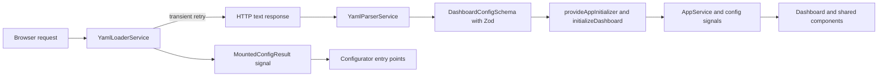
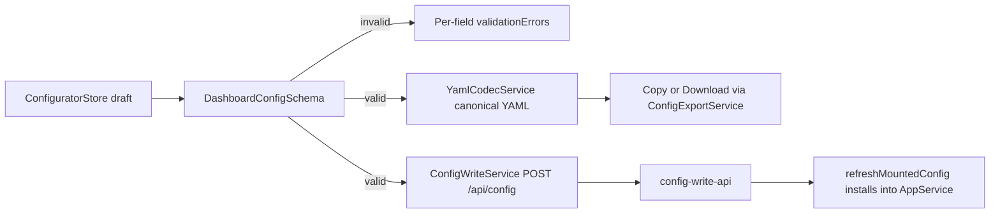
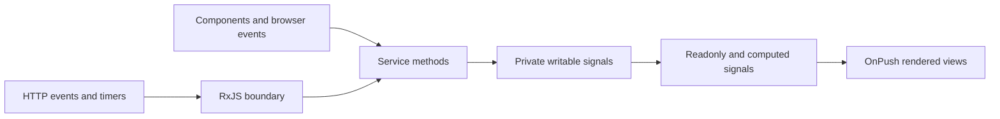
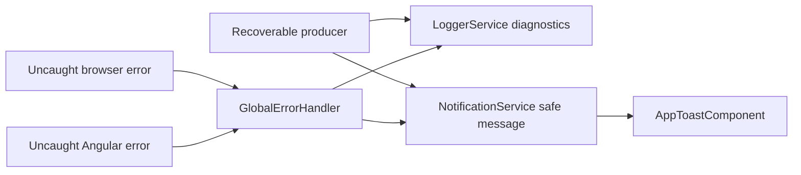

# Mando Architecture

Mando is a client-rendered Angular dashboard configured from one YAML file. It renders two routes:
the dashboard view, and a browser-based configurator that edits the same configuration. The
application validates the YAML, installs the resulting configuration into signal-based state, and
renders the active route. The production container serves the compiled app and the mounted YAML
through nginx, and also runs an optional write sidecar (`server/`) that the configurator's "Save"
action posts to, gated by a shared-secret token.

This guide describes the current implementation. Use it to locate ownership, preserve dependency
direction, and choose the smallest verification scope for a change.

## Read This First

For a first contribution:

1. Read [README.md](README.md) for setup and user-facing configuration.
2. Read [AGENTS.md](AGENTS.md) for project coding, state, accessibility, and error conventions.
3. Start the app with `npm install` and `npm start`. Use `npm run dev` to also run the write
   sidecar (needed only for the configurator's Save action).
4. Follow startup from [src/main.ts](src/main.ts) to
   [src/app/app.config.ts](src/app/app.config.ts), then to
   [dashboard.initializer.ts](src/app/core/initializers/dashboard.initializer.ts).
5. For UI work, begin at
   [dashboard.component.ts](src/app/views/dashboard/dashboard.component.ts) or
   [configurator-page.component.ts](src/app/features/configurator/configurator-page.component.ts)
   and move into the relevant shared component.
6. Run `npm test`, `npm run lint`, `npm run format:check`, and `npm run build` before review. For
   sidecar changes also run `npm --prefix server run typecheck` and `npm --prefix server test`.

## Stack

Versions below are the ranges declared in [package.json](package.json) and
[server/package.json](server/package.json).

| Technology              | Current version | Role                                                                 |
| ----------------------- | --------------- | -------------------------------------------------------------------- |
| Angular                 | 21.2            | Standalone application, DI, signals, HTTP, routing, and build        |
| TypeScript              | 5.9             | Strictly typed application, sidecar, and tests                       |
| RxJS                    | 7.8             | HTTP startup flow and other genuine asynchronous boundaries          |
| Vitest                  | 4.0             | Unit and component tests, in the app and the sidecar                 |
| Angular Testing Library | 19.1            | User-oriented component rendering and interaction tests              |
| Tailwind CSS            | 4.1             | Utility-first styling, including class-based dark mode               |
| Zod                     | 4.3             | Runtime dashboard schema and inferred types, shared with the sidecar |
| js-yaml                 | 4.3             | YAML text parsing and serialization, shared with the sidecar         |
| Fastify                 | 5.2             | `server/` config-write sidecar HTTP server                           |
| Angular CLI / build     | 21.2            | Development server, production bundle, and test integration          |

Supporting tools include ESLint 9, Prettier 3, axe-core 4, PostCSS 8, esbuild (sidecar bundling),
and npm 11. CI uses Node 22; the Docker build stages use `node:20-alpine`, and the production image
adds the Node runtime so the sidecar can run beside nginx.

## Repository Shape

```text
src/
  main.ts                 browser bootstrap
  app/
    app.config.ts         root providers and the single startup initializer
    app.ts, app.html      root composition: app shell, routed outlet, global toast outlet
    app.routes.ts         dashboard route plus the lazy configurator route
    core/
      errors/             last-resort global error handling
      initializers/       startup orchestration
      models/             Zod schemas, inferred types, defaults, shared validation
      services/           configuration, state, domain operations, and diagnostics
    features/
      configurator/       browser-based YAML editor, loaded as a lazy route
    shared/components/    reusable or feature-level presentation components
    views/dashboard/      dashboard page composition
  testing/                shared test helpers and tooling regression tests
public/
  config/                 runtime YAML and user-facing example
  img/                    static backgrounds and branding
server/                   config-write-api sidecar (own package.json and tests)
  src/
    index.ts              environment parsing and listen
    app.ts                Fastify instance: authenticated POST /api/config
    write-config.ts       atomic file write with .bak rotation
```

Root build and delivery files are [angular.json](angular.json), [proxy.conf.json](proxy.conf.json),
[Dockerfile](Dockerfile), [entrypoint.sh](entrypoint.sh), and [nginx.conf](nginx.conf). CI workflows
live in [.github/workflows](.github/workflows).

### Dependency Rules

- `core/` owns schemas, state, startup, infrastructure adapters, and cross-cutting services. It
  must not depend on views, features, or shared components.
- `shared/components/` may consume core services and models. Components expose UI contracts with
  `input()` and `output()` when parent-child communication is appropriate.
- `views/` and `features/` compose shared components and connect them to core state. Page-specific
  effects, such as selecting the configured background for the resolved theme, stay at this
  boundary. Nothing depends back into a view or a feature.
- Feature-scoped services are provided at the route, not at root. `ConfiguratorStore` is registered
  in `CONFIGURATOR_ROUTES` and lives only while the `configure` route is active.
- `server/` is a separate npm package. It imports exactly one file from the app,
  [dashboard.models.ts](src/app/core/models/dashboard.models.ts), to share the Zod schema, and
  nothing else. Keep that file free of Angular and browser-only imports.
- `app.ts` is composition only. It places `AppShellComponent` and the routed outlet beside the
  global `AppToastComponent`; it does not own feature state.
- Tests remain beside the code they protect. Cross-cutting helpers belong in `src/testing/`.
- `public/` is copied as static output. Do not import runtime configuration into the bundle.

### Routing

[app.routes.ts](src/app/app.routes.ts) declares two routes. `''` renders `DashboardComponent`
directly. `configure` lazy-loads `CONFIGURATOR_ROUTES`, which provides `ConfiguratorStore` and
renders `ConfiguratorPageComponent`. [AppShellComponent](src/app/shared/components/app-shell/app-shell.component.ts)
— a fixed header, a scrollable `<router-outlet>`, and a fixed footer — wraps both routes.
`AppHeaderComponent` derives one navigation control from the active URL that toggles between the
dashboard and the configurator.

## Startup and Configuration

The browser requests `/config/dashboard.yaml`. Development serves the copy under `public/config/`;
the production nginx location aliases that URL to `/app/config/dashboard.yaml`, normally a mounted
file.



The exact ownership sequence is:

1. `bootstrapApplication(App, appConfig)` starts the standalone root.
2. `appConfig` registers HTTP, the router, browser global error listeners, the custom error
   handler, and `provideAppInitializer(initializeDashboard)`.
3. Angular subscribes to the initializer's `Observable<void>` and waits for completion before
   bootstrap completes.
4. `YamlLoaderService` fetches YAML text, then `YamlParserService` uses js-yaml and
   `DashboardConfigSchema.safeParse` to produce a typed `DashboardConfig`.
5. `loadDashboardConfig` maps the outcome to a loaded config or a cloned default, and
   `initializeDashboard` calls `AppService.initializeConfig` exactly once with the result.
6. Core computed signals derive metadata, settings, categories, bookmarks, and filtered apps for
   the view tree.

`AppService` has no constructor and performs no I/O. The initializer is the only installation
owner; services expose state and transformations rather than independently starting configuration
loads.

### Mounted Configuration Outcomes

`YamlLoaderService` caches the single startup request and keeps its outcome as a
`MountedConfigResult`, exposed as the `mountedConfigResult` signal so the configurator can react to
it without re-fetching:

| Outcome       | Cause                               | Startup effect                                |
| ------------- | ----------------------------------- | --------------------------------------------- |
| `valid`       | file parsed and passed the schema   | dashboard uses the mounted configuration      |
| `missing`     | HTTP 404 — no file mounted          | first run: dashboard uses defaults, silently  |
| `unavailable` | other HTTP failure, after retries   | dashboard uses defaults and one warning toast |
| `invalid`     | js-yaml or Zod rejected the content | dashboard uses defaults and one warning toast |

### Retry and Fallback Ownership

`YamlLoaderService` retries only `HttpErrorResponse` statuses `0`, `408`, `429`, and `500` through
`599`. Its three retries wait 250 ms, 500 ms, and 1000 ms. Other HTTP failures and deterministic
YAML parse or Zod schema failures are not retried.

After a non-retryable failure the loader records the `MountedConfigResult`, and `loadDashboardConfig`
returns a cloned default configuration. Only `unavailable` and `invalid` log a warning and emit one
warning toast; `missing` is silent, because an unmounted file is the expected first-run state. The
initializer's own catch is a final defensive boundary for errors that escape the loader: it logs
once, emits one startup error, installs `DEFAULT_DASHBOARD_CONFIG`, and completes. Producers must
not duplicate notifications already owned by a fallback boundary.

`DEFAULT_DASHBOARD_CONFIG` is intentionally not a schema-valid document — it has no categories or
applications. The virtual `apps` category is supplied by `CategoryService` at render time;
`apps`, `bookmarks`, and `favorites` are reserved category IDs that `DashboardConfigSchema` rejects
in user configuration. The schema and defaults are in
[dashboard.models.ts](src/app/core/models/dashboard.models.ts), which also holds the
cross-collection rules (IDs unique across categories, applications, and bookmarks; every
application `category` must match a declared category ID). Use
[dashboard.example.yaml](public/config/dashboard.example.yaml) as the user-facing configuration
example; keep it aligned when changing the schema.

## Configuration Editing

The `configure` route renders a browser-only editor that produces the same YAML the loader
consumes. It changes nothing on its own; the only write path is the explicit Save action.

`ConfiguratorStore` (provided per route) holds a `ConfiguratorDraft` signal plus `isDirty` and
`validationErrors`. Three entry points seed the draft:

- **Start empty** — a blank draft.
- **Load mounted YAML** — offered only when `mountedConfigResult()` is `valid`; clones the running
  configuration into the draft.
- **Import local YAML** — parses a picked file through `YamlCodecService`; failures populate
  `validationErrors` instead of replacing the draft.

Edits go through typed store methods (`updateMetadata`, `addCategory`, `updateApplication`,
`moveBookmark`, and so on). `toDashboardConfig()` runs the shared `DashboardConfigSchema` and
returns `undefined` while the draft is invalid, publishing per-field errors. Because the schema
requires at least one category and one application, an empty draft cannot be exported or saved.



Output paths:

- **Copy / Download** — `serializeExportableDraft()` serializes only a schema-valid config to
  canonical YAML through `YamlCodecService`; `ConfigExportService` performs the clipboard or
  blob-download effect and its notification.
- **Save to server** — posts the validated config to the write sidecar via `ConfigWriteService`. A
  missing token opens an inline prompt; the token is kept in `localStorage` under
  `config-write-token` and cleared on a `401`. On success the store is marked clean and
  `YamlLoaderService.refreshMountedConfig()` re-fetches the YAML and installs it into live
  `AppService` state, so the dashboard reflects the save without a reload.

## Config Write Sidecar

`server/` is a standalone Fastify service, bundled into the production image and started beside
nginx. It exposes one route, `POST /api/config`:

1. An `onRequest` hook compares the `x-config-token` header to `CONFIG_WRITE_TOKEN` before Fastify
   parses the body; a mismatch returns `401` and the payload is never read.
2. The body is validated with the shared `DashboardConfigSchema`. Failures return
   `400 {status: 'invalid', errors}` in the same `ParseError` shape the browser uses; an oversized
   body returns `413`.
3. A valid config is normalized with `omitBlankBackgroundImages` (shared with the browser export so
   Save and Copy/Download never disagree) and dumped to YAML.
4. `writeConfigAtomically` writes `dashboard.yaml.tmp`, fsyncs it, copies any existing file to
   `dashboard.yaml.bak`, then renames the temp file into place. A failure at any step leaves the
   live file intact.

[index.ts](server/src/index.ts) requires `CONFIG_WRITE_TOKEN` (it exits with code 1 without one)
and reads `CONFIG_PATH` (default `/app/config/dashboard.yaml`), `PORT` (default 3000), and `HOST`.
In the container, nginx proxies `/api/` to `127.0.0.1:3000`, and [entrypoint.sh](entrypoint.sh)
starts the sidecar in the background then execs nginx, with `tini` as PID 1. Locally, `npm run dev`
([scripts/dev.sh](scripts/dev.sh)) runs both processes and [proxy.conf.json](proxy.conf.json)
forwards `/api` from the dev server to the sidecar.

Without `CONFIG_WRITE_TOKEN`, or with the config mounted read-only, the dashboard still serves
normally — only Save fails, and Copy/Download remain available.

## State and Interaction Flow

Synchronous application and UI state uses writable private signals, readonly public signals, and
`computed()` derivations. `AppService` is the facade for configuration installation, search query,
category selection, app lookup, and the combined/filtered application list. Focused services retain
ownership of their own state.



Examples:

- `AppFinderComponent` keeps input and selected search engine UI state locally. Application search
  calls `AppService.setSearchQuery`, which delegates to `SearchService`.
- `AppCategoriesComponent` delegates selection through `AppService.setSelectedCategory`.
- `AppService.filteredApps` combines configuration, bookmarks, search, and category signals.
- `NotificationService` owns a bounded signal list and timer-backed dismissal.
- `ThemeService` owns theme mode and resolved light/dark signals.
- `ConfiguratorStore` owns the editor draft, dirty flag, and validation errors for the lifetime of
  the `configure` route.

Use RxJS for HTTP, browser event streams, debounce, or multi-source asynchronous orchestration. Do
not introduce `BehaviorSubject` as a general store or wrap synchronous signal state in observables.

## Theme Resolution

`ThemeService` resolves mode in this order:

1. A non-empty persisted value under `dashboard-theme` is treated as the user's preference and
   wins over configuration. The storage value is type-cast rather than runtime-validated.
2. Without a persisted value, the YAML `settings.theme` value controls the mode and may update when
   configuration arrives.
3. An explicit user selection calls `setThemeMode`, takes precedence for the session, and attempts
   to persist.
4. Mode `auto`, whether configured, persisted, or selected, resolves through the system
   `prefers-color-scheme: dark` media query.

The resolved theme updates the root `dark` class and `data-theme` attribute. System changes update
the rendered theme only while mode is `auto`. Dashboard background selection reacts to both
settings and resolved theme.

Storage failures are non-fatal. A read failure logs and warns, then falls back to configured theme.
A write failure logs and warns, while preserving the user's selection for the current session. The
YAML setting itself is not written to browser storage.

## Error and Notification Flow

Expected failures recover locally. Diagnostics and user copy have separate owners:



- Producers send technical context to `LoggerService`; user-facing messages must be concise and
  safe through `NotificationService`. The configurator and its services use the same path.
- Retry only known transient operations. The final fallback owns one notification.
- `NotificationService` trims empty messages, allows at most five active notifications, and
  automatically dismisses each after five seconds.
- `AppToastComponent` is mounted once at the root and renders the shared notification state.
- `GlobalErrorHandler` is the last resort for uncaught Angular and browser errors. It normalizes
  diagnostics, logs them, and shows the generic message `An unexpected error occurred.`
- The global handler uses raw `console.error` only if its injected logger or notification path
  itself fails. The bootstrap promise catch in `main.ts` also logs a rejected bootstrap directly.

## Components and UI

Components are standalone by default and use `ChangeDetectionStrategy.OnPush`. New components
should stay focused, inject services with `inject()`, use signal `input()` and `output()` APIs, and
place host behavior in the decorator `host` object.

Templates use native control flow and simple expressions. Prefer semantic HTML and preserve visible
focus, keyboard operation, accessible names, ARIA relationships, and WCAG AA contrast. Static image
work should use `NgOptimizedImage` where applicable. The search engine selector is a useful local
reference for parent-child output, keyboard navigation, and focus restoration;
`CollectionEditorComponent` is the reference for editing a list of items with add, remove, and
reorder, per-row field errors, and focus management after add and remove.

## Testing and CI

Tests focus on observable behavior: startup completion, retry boundaries, fallback ownership,
signal derivations, rendered interactions, accessibility, failure guards, and — for the sidecar —
token auth, schema rejection, and the atomic write. Service and initializer specs sit beside their
source; Angular Testing Library drives component behavior; `server/src/*.spec.ts` cover the sidecar.

`npm test` first runs the committed-focused-test guard through `pretest`, then runs Angular's Vitest
integration. CI ([.github/workflows/test.yml](.github/workflows/test.yml), on pull requests to
`develop` and `main`) runs `npm run check:focused-tests`, lint, source formatting, coverage, a
production build, and then the sidecar's `npm ci`, `npm run typecheck`, and `npm test` in `server/`.

Coverage includes `src/app/core/services/**/*.ts` and `src/app/core/initializers/**/*.ts`, excluding
spec files. The statement threshold is 70%. The latest stable measurement is recorded in the
[v2.0.0 changelog](CHANGELOG.md#v200); treat CI output as authoritative if code has changed. CI
always uploads `coverage/` as the `coverage-report` artifact.

The shared [axe helper](src/testing/a11y.ts) checks covered rendered states. It disables
`color-contrast` because jsdom cannot evaluate that rule reliably, so browser/manual contrast
verification remains required. Automated AXE success is not proof of complete WCAG compliance.

Useful commands:

```bash
npm start
npm run dev
npm run check:focused-tests
npm run lint
npm run format:check
npm test
npm run test:coverage
npm run build -- --configuration production
npm --prefix server run typecheck
npm --prefix server test
```

## Build and Deployment

Angular uses the `@angular/build:application` builder. `public/` is copied into the bundle, and the
production browser output consumed by Docker is `dist/getmando/browser`.

The [Dockerfile](Dockerfile) has three build stages:

1. `node:20-alpine` (`builder`) runs `npm ci` and the production Angular build.
2. `node:20-alpine` (`server-builder`) runs `npm ci` in `server/`, bundles `server/src` into a
   single ESM file with esbuild — inlining the shared `dashboard.models.ts` import and leaving npm
   packages external — then prunes dev dependencies.
3. `nginx:alpine` receives the browser output, the server bundle and its `node_modules`, the nginx
   configuration, `entrypoint.sh`, a curl-based health check, the Node runtime and `tini`, and a
   writable `/app/config` mount directory.

[nginx.conf](nginx.conf) serves the single-page application with an `index.html` fallback. Hashed
static assets receive long immutable caching; the application shell and dashboard YAML are not
cached. `/config/dashboard.yaml` aliases `/app/config/dashboard.yaml`, `/api/` is proxied to the
sidecar on `127.0.0.1:3000`, `/health` returns HTTP 200, and hidden files are denied. The default
public YAML is part of a local Angular build, but the container location expects the mounted
runtime file. `ENTRYPOINT` is `tini -- /entrypoint.sh`, which backgrounds the sidecar and execs
nginx as the foreground process.

On pushes to `main`, the Docker workflow builds `linux/amd64` and `linux/arm64` images and publishes
`latest`, package-version, and commit-SHA tags to GHCR. A separate workflow reads the version from
`package.json`, tags `v<version>`, and creates the matching GitHub release.

## Change Map

| Change                         | Start here                                                                 | Verify                                                                 |
| ------------------------------ | -------------------------------------------------------------------------- | ---------------------------------------------------------------------- |
| Config schema or defaults      | `dashboard.models.ts`, parser, example YAML                                | Parser and loader specs; fallback; sidecar validation; README          |
| Mounted-config outcomes        | `YamlLoaderService`, `dashboard.initializer.ts`                            | Retry boundary, each `MountedConfigResult`, warning ownership          |
| Configurator editing or export | `ConfiguratorStore`, `configurator-page.component`, `YamlCodecService`     | Draft validation, per-field errors, canonical YAML, empty-draft guard  |
| Config write / Save            | `ConfigWriteService`, `server/src/app.ts`, `write-config.ts`, `nginx.conf` | Token auth, shared-schema rejection, atomic write + `.bak`, proxy path |
| Theme or backgrounds           | `ThemeService`, `SettingsService`, dashboard view                          | Precedence, storage failures, auto media changes, both backgrounds     |
| Search or categories           | `SearchService`, `CategoryService`, `AppService`                           | Local UI state, computed filtering, keyboard behavior                  |
| Notifications or errors        | Producer, `NotificationService`, `GlobalErrorHandler`                      | One notification owner, safe copy, diagnostics, root toast             |
| Deployment or config mount     | `angular.json`, Dockerfile, nginx config, `entrypoint.sh`                  | Output path, cache rules, mount path, `/api` proxy, health, multi-arch |

Keep this document descriptive, not aspirational. When ownership or a flow changes, update the
relevant diagram and change-map row in the same work unit.
