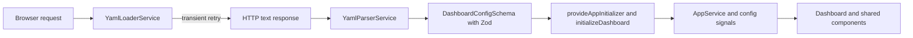
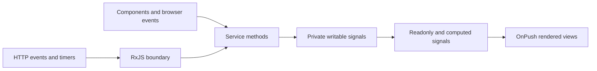
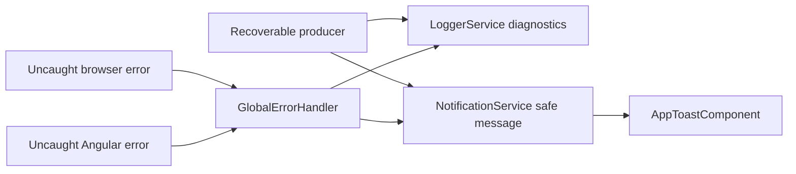

# Mando Architecture

Mando is a client-rendered Angular dashboard configured at startup from one YAML file. The
application validates that file, installs the resulting configuration into signal-based state,
and renders a single dashboard view. It has no application backend: the production container
serves the compiled files and a mountable YAML file through nginx.

This guide describes the current implementation. Use it to locate ownership, preserve dependency
direction, and choose the smallest verification scope for a change.

## Read This First

For a first contribution:

1. Read [README.md](README.md) for setup and user-facing configuration.
2. Read [AGENTS.md](AGENTS.md) for project coding, state, accessibility, and error conventions.
3. Start the app with `npm install` and `npm start`.
4. Follow startup from [src/main.ts](src/main.ts) to
   [src/app/app.config.ts](src/app/app.config.ts), then to
   [dashboard.initializer.ts](src/app/core/initializers/dashboard.initializer.ts).
5. For UI work, begin at
   [dashboard.component.ts](src/app/views/dashboard/dashboard.component.ts) and move into the
   relevant shared component.
6. Run `npm test`, `npm run lint`, `npm run format:check`, and `npm run build` before review.

## Stack

Versions below are the ranges declared in [package.json](package.json).

| Technology              | Current version | Role                                                               |
| ----------------------- | --------------- | ------------------------------------------------------------------ |
| Angular                 | 21.1            | Standalone application, DI, signals, HTTP, rendering, and build    |
| TypeScript              | 5.9             | Strictly typed application and tests                               |
| RxJS                    | 7.8             | HTTP startup flow and other genuine asynchronous boundaries        |
| Vitest                  | 4.0             | Unit and component test runner through Angular's unit-test builder |
| Angular Testing Library | 19.1            | User-oriented component rendering and interaction tests            |
| Tailwind CSS            | 4.1             | Utility-first styling, including class-based dark mode             |
| Zod                     | 4.3             | Runtime dashboard schema and inferred TypeScript types             |
| js-yaml                 | 4.1             | YAML text parsing before Zod validation                            |
| Angular CLI / build     | 21.1            | Development server, production bundle, and test integration        |

Supporting tools include ESLint 9, Prettier 3, axe-core 4, PostCSS 8, and npm 11. CI uses Node
22; the current Docker build stage uses `node:20-alpine`.

## Repository Shape

```text
src/
  main.ts                 browser bootstrap
  app/
    app.config.ts         root providers and the single startup initializer
    app.ts, app.html      root composition: dashboard plus global toast outlet
    core/
      errors/             last-resort global error handling
      initializers/       startup orchestration
      models/             Zod schemas, inferred types, and defaults
      services/           configuration, state, domain operations, and diagnostics
    shared/components/    reusable or feature-level presentation components
    views/dashboard/      dashboard page composition
  testing/                shared test helpers and tooling regression tests
public/
  config/                 runtime YAML and user-facing example
  img/                    static backgrounds and branding
```

Root build and delivery files are [angular.json](angular.json), [Dockerfile](Dockerfile), and
[nginx.conf](nginx.conf). CI workflows live in [.github/workflows](.github/workflows).

### Dependency Rules

- `core/` owns schemas, state, startup, infrastructure adapters, and cross-cutting services. It
  must not depend on views or shared components.
- `shared/components/` may consume core services and models. Components expose UI contracts with
  `input()` and `output()` when parent-child communication is appropriate.
- `views/` compose shared components and connect them to core state. Page-specific effects, such
  as selecting the configured background for the resolved theme, stay at this boundary.
- `app.ts` is composition only. It places `DashboardComponent` beside the global
  `AppToastComponent`; it does not own feature state.
- Tests remain beside the code they protect. Cross-cutting helpers belong in `src/testing/`.
- `public/` is copied as static output. Do not import runtime configuration into the bundle.

There are currently no application routes; [app.routes.ts](src/app/app.routes.ts) exports an empty
route list. The dashboard is composed directly by the root component.

## Startup and Configuration

The browser requests `/config/dashboard.yaml`. Development serves the copy under `public/config/`;
the production nginx location aliases that URL to `/app/config/dashboard.yaml`, normally a mounted
file.



The exact ownership sequence is:

1. `bootstrapApplication(App, appConfig)` starts the standalone root.
2. `appConfig` registers HTTP, the empty router, browser global error listeners, the custom error
   handler, and `provideAppInitializer(initializeDashboard)`.
3. Angular subscribes to the initializer's `Observable<void>` and waits for completion before
   bootstrap completes.
4. `YamlLoaderService` fetches YAML text, then `YamlParserService` uses js-yaml and
   `DashboardConfigSchema.safeParse` to produce a typed `DashboardConfig`.
5. `initializeDashboard` calls `AppService.initializeConfig` exactly once with loaded or fallback
   configuration.
6. Core computed signals derive metadata, settings, categories, bookmarks, and filtered apps for
   the view tree.

`AppService` has no constructor and performs no I/O. The initializer is the only installation
owner; services expose state and transformations rather than independently starting configuration
loads.

### Retry and Fallback Ownership

`YamlLoaderService` retries only `HttpErrorResponse` statuses `0`, `408`, `429`, and `500` through
`599`. Its three retries wait 250 ms, 500 ms, and 1000 ms. Other HTTP failures and deterministic
YAML parse or Zod schema failures are not retried.

After attempts are exhausted, or after a deterministic failure, the loader logs diagnostics,
emits one safe warning, and returns a cloned default configuration. The initializer then installs
that value normally. Its own catch is a final defensive boundary for errors that escape the loader:
it logs once, emits one startup error, installs `DEFAULT_DASHBOARD_CONFIG`, and completes. Producers
must not duplicate notifications already owned by a fallback boundary.

The schema and defaults are in
[dashboard.models.ts](src/app/core/models/dashboard.models.ts). Use
[dashboard.example.yaml](public/config/dashboard.example.yaml) as the user-facing configuration
example; keep it aligned when changing the schema.

## State and Interaction Flow

Synchronous application and UI state uses writable private signals, readonly public signals, and
`computed()` derivations. `AppService` is the facade for configuration installation, search query,
category selection, app lookup, and the combined/filtered application list. Focused services retain
ownership of their own state.



Examples:

- `AppFinderComponent` keeps input and selected search engine UI state locally. Application search
  calls `AppService.setSearchQuery`, which delegates to `SearchService`.
- `AppCategoriesComponent` delegates selection through `AppService.setSelectedCategory`.
- `AppService.filteredApps` combines configuration, bookmarks, search, and category signals.
- `NotificationService` owns a bounded signal list and timer-backed dismissal.
- `ThemeService` owns theme mode and resolved light/dark signals.

Use RxJS for HTTP, browser event streams, debounce, or multi-source asynchronous orchestration. Do
not introduce `BehaviorSubject` as a general store or wrap synchronous signal state in observables.

## Theme Resolution

`ThemeService` resolves mode in this order:

1. A non-empty persisted value under `dashboard-theme` is treated as the user's preference and
   wins over configuration. The storage value is type-cast rather than runtime-validated.
2. Without a persisted value, the YAML `settings.theme` value controls the mode and may update when
   configuration arrives.
3. An explicit user selection calls `setThemeMode`, takes precedence for the session, and attempts
   to persist.
4. Mode `auto`, whether configured, persisted, or selected, resolves through the system
   `prefers-color-scheme: dark` media query.

The resolved theme updates the root `dark` class and `data-theme` attribute. System changes update
the rendered theme only while mode is `auto`. Dashboard background selection reacts to both
settings and resolved theme.

Storage failures are non-fatal. A read failure logs and warns, then falls back to configured theme.
A write failure logs and warns, while preserving the user's selection for the current session. The
YAML setting itself is not written to browser storage.

## Error and Notification Flow

Expected failures recover locally. Diagnostics and user copy have separate owners:



- Producers send technical context to `LoggerService`; user-facing messages must be concise and
  safe through `NotificationService`.
- Retry only known transient operations. The final fallback owns one notification.
- `NotificationService` trims empty messages, allows at most five active notifications, and
  automatically dismisses each after five seconds.
- `AppToastComponent` is mounted once at the root and renders the shared notification state.
- `GlobalErrorHandler` is the last resort for uncaught Angular and browser errors. It normalizes
  diagnostics, logs them, and shows the generic message `An unexpected error occurred.`
- The global handler uses raw `console.error` only if its injected logger or notification path
  itself fails. The bootstrap promise catch in `main.ts` also logs a rejected bootstrap directly.

## Components and UI

Components are standalone by default and use `ChangeDetectionStrategy.OnPush`. New components
should stay focused, inject services with `inject()`, use signal `input()` and `output()` APIs, and
place host behavior in the decorator `host` object.

Templates use native control flow and simple expressions. Prefer semantic HTML and preserve visible
focus, keyboard operation, accessible names, ARIA relationships, and WCAG AA contrast. Static image
work should use `NgOptimizedImage` where applicable. The search engine selector is a useful local
reference for parent-child output, keyboard navigation, and focus restoration.

## Testing and CI

Tests focus on observable behavior: startup completion, retry boundaries, fallback ownership,
signal derivations, rendered interactions, accessibility, and failure guards. Service and
initializer specs sit beside their source; Angular Testing Library drives component behavior.

`npm test` first runs the committed-focused-test guard through `pretest`, then runs Angular's Vitest
integration. CI separately runs `npm run check:focused-tests`, lint, source formatting, coverage,
and a production build.

Coverage includes `src/app/core/services/**/*.ts` and `src/app/core/initializers/**/*.ts`, excluding
spec files. The statement threshold is 70%. The latest stable measurement documented in the
[Unreleased changelog](CHANGELOG.md#unreleased) is 97.31%; treat CI output as authoritative if code
has changed. CI always uploads `coverage/` as the `coverage-report` artifact.

The shared [axe helper](src/testing/a11y.ts) checks covered rendered states. It disables
`color-contrast` because jsdom cannot evaluate that rule reliably, so browser/manual contrast
verification remains required. Automated AXE success is not proof of complete WCAG compliance.

Useful commands:

```bash
npm start
npm run check:focused-tests
npm run lint
npm run format:check
npm test
npm run test:coverage
npm run build -- --configuration production
```

## Build and Deployment

Angular uses the `@angular/build:application` builder. `public/` is copied into the bundle, and the
production browser output consumed by Docker is `dist/getmando/browser`.

The [Dockerfile](Dockerfile) has two stages:

1. `node:20-alpine` runs `npm ci` and the production Angular build.
2. `nginx:alpine` receives the browser output, nginx configuration, curl-based health check, and a
   writable `/app/config` mount directory.

[nginx.conf](nginx.conf) serves the single-page application with an `index.html` fallback. Hashed
static assets receive long immutable caching; the application shell and dashboard YAML are not
cached. `/config/dashboard.yaml` aliases `/app/config/dashboard.yaml`, `/health` returns HTTP 200,
and hidden files are denied. The default public YAML is part of a local Angular build, but the
container location expects the mounted runtime file.

On pushes to `main`, the Docker workflow builds `linux/amd64` and `linux/arm64` images and publishes
`latest`, package-version, and commit-SHA tags to GHCR.

## Change Map

| Change                     | Start here                                            | Verify                                                               |
| -------------------------- | ----------------------------------------------------- | -------------------------------------------------------------------- |
| Config schema or defaults  | `dashboard.models.ts`, parser, example YAML           | Parser and loader specs; fallback; README reference                  |
| Theme or backgrounds       | `ThemeService`, `SettingsService`, dashboard view     | Precedence, storage failures, auto media changes, both backgrounds   |
| Search or categories       | `SearchService`, `CategoryService`, `AppService`      | Local UI state, computed filtering, keyboard behavior                |
| Notifications or errors    | Producer, `NotificationService`, `GlobalErrorHandler` | One notification owner, safe copy, diagnostics, root toast           |
| Deployment or config mount | `angular.json`, Dockerfile, nginx config              | Output path, cache rules, mount path, health check, multi-arch build |

Keep this document descriptive, not aspirational. When ownership or a flow changes, update the
relevant diagram and change-map row in the same work unit.
