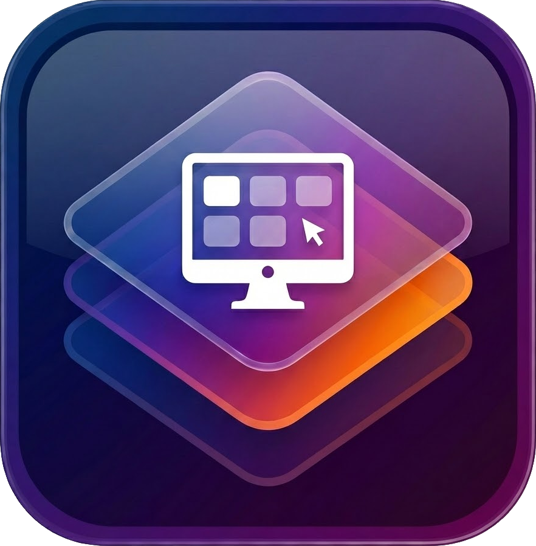
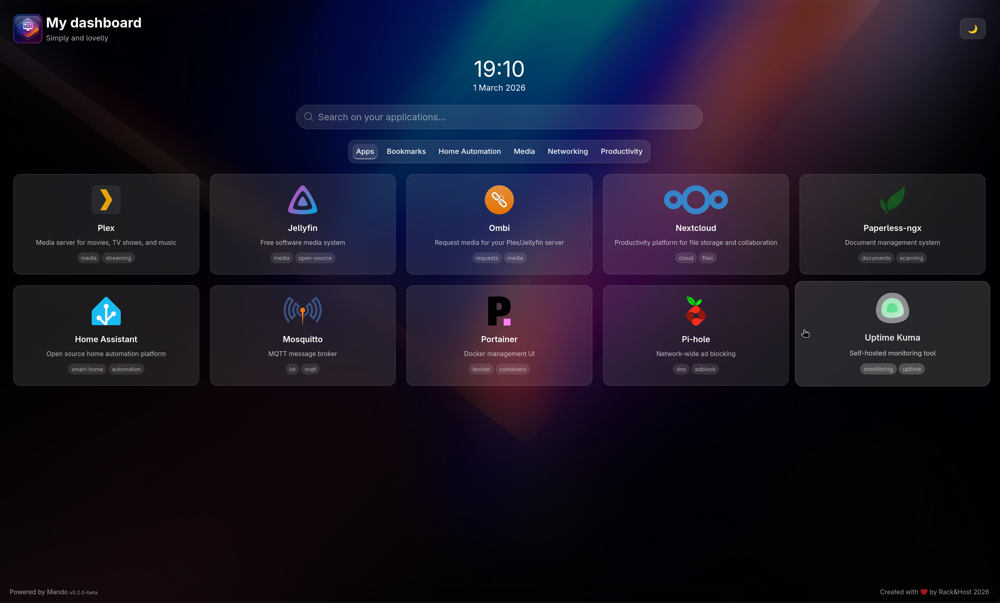

<p align="center">
  
  <br>
  <em>Mando</em>
  <br>
  <em>A simply and beautiful dashboard</em>
</p>


> **⚠️ BETA RELEASE WARNING**  
> This project is currently in **beta testing** (v0.1.0-beta). Features may change, bugs are expected, and the API could evolve. Use at your own risk in production environments. Feedback and bug reports are highly appreciated!

---



## 📖 Overview

**Mando** is a beautiful and simply dashboard (not pretend to add too many features such a widgets, weather, etc...) for your self-hosted applications. Built with modern web technologies, it provides an elegant glassmorphism UI to organize and access all your homelab services from a single place. 

### ✨ Key Features

- **🎨 Inspiring Design** - Minimalist interface with glassmorphism effects
- **⚡ Fast & Lightweight** - Built with Angular 21 and TailwindCSS 4 for optimal performance
- **🔍 Real-time Search** - Instant search through your applications
- **🏷️ Categories** - Organize your apps into customizable categories
- **🔗 Web Search Integration** - Built-in support for Google, DuckDuckGo, Startpage, and YouTube
- **📱 Fully Responsive** - Optimized for mobile, tablet, and desktop
- **♿ Accessible** - WCAG AA compliant with keyboard navigation
- **🐳 Docker Ready** - Easy deployment with pre-built containers
- **⚙️ YAML Configuration** - Simple, declarative configuration file

---

## 🚀 Quick Start (Docker)

### Using Docker Compose (Recommended)

1. **Create and customize the `dashboard.yaml`** file with all your data and settings.
```yaml
metadata:
  title: 'My dashboard'
  description: 'Simply and lovelly'

categories:
  - id: 'media'
    name: 'Media'

  - id: 'productivity'
    name: 'Productivity'

  - id: 'home-automation'
    name: 'Home Automation'

  - id: 'networking'
    name: 'Networking'

applications:
  - id: 'plex'
    name: 'Plex'
    description: 'Media server for movies, TV shows, and music'
    url: 'https://plex.example.com'
    icon:
      type: 'name'
      value: 'plex'
    category: 'media'
    openNewTab: true
    tags:
      - media
      - streaming

  - id: 'jellyfin'
    name: 'Jellyfin'
    description: 'Free software media system'
    url: 'https://jellyfin.example.com'
    icon:
      type: 'name'
      value: 'jellyfin'
    category: 'media'
    openNewTab: true
    tags:
      - media
      - open-source

  - id: 'ombi'
    name: 'Ombi'
    description: 'Request media for your Plex/Jellyfin server'
    url: 'https://ombi.example.com'
    icon:
      type: 'name'
      value: 'ombi'
    category: 'media'
    openNewTab: true
    tags:
      - requests
      - media

  - id: 'nextcloud'
    name: 'Nextcloud'
    description: 'Productivity platform for file storage and collaboration'
    url: 'https://nextcloud.example.com'
    icon:
      type: 'name'
      value: 'nextcloud'
    category: 'productivity'
    openNewTab: true
    tags:
      - cloud
      - files

  - id: 'paperless-ngx'
    name: 'Paperless-ngx'
    description: 'Document management system'
    url: 'https://paperless.example.com'
    icon:
      type: 'name'
      value: 'paperless-ngx'
    category: 'productivity'
    openNewTab: true
    tags:
      - documents
      - scanning

  - id: 'home-assistant'
    name: 'Home Assistant'
    description: 'Open source home automation platform'
    url: 'https://homeassistant.example.com'
    icon:
      type: 'name'
      value: 'home-assistant'
    category: 'home-automation'
    openNewTab: true
    tags:
      - smart-home
      - automation

  - id: 'mosquitto'
    name: 'Mosquitto'
    description: 'MQTT message broker'
    url: 'https://mosquitto.example.com'
    icon:
      type: 'name'
      value: 'mosquitto'
    category: 'home-automation'
    openNewTab: true
    tags:
      - iot
      - mqtt

  - id: 'portainer'
    name: 'Portainer'
    description: 'Docker management UI'
    url: 'https://portainer.example.com'
    icon:
      type: 'name'
      value: 'portainer'
    category: 'networking'
    openNewTab: true
    tags:
      - docker
      - containers

  - id: 'pihole'
    name: 'Pi-hole'
    description: 'Network-wide ad blocking'
    url: 'https://pihole.example.com'
    icon:
      type: 'name'
      value: 'pi-hole'
    category: 'networking'
    openNewTab: true
    tags:
      - dns
      - adblock

  - id: 'uptime-kuma'
    name: 'Uptime Kuma'
    description: 'Self-hosted monitoring tool'
    url: 'https://uptime.example.com'
    icon:
      type: 'name'
      value: 'uptime-kuma'
    category: 'networking'
    openNewTab: true
    tags:
      - monitoring
      - uptime

bookmarks:
  - id: 'google'
    name: 'Google'
    description: 'The google web'
    url: 'https://google.com'
    openNewTab: true
    icon:
      type: 'name'
      value: 'google'
    tags:
      - web

settings:
  dateFormat: 'd MMMM yyyy'
  datePosition: 'bottom'
  showSeconds: false
  showDate: true
  itemsPerRow: 5
  allowBookmarks: true
  showAllCategory: true
  showDescriptions: true
  showLabels: true
  searchEngines:
    - 'google'
    - 'duckduckgo'
    - 'startpage'
    - 'youtube'

```

2. **Create the `docker-compose.yaml` file:**
 ```yaml
services:
  dashboard:
    image: ghcr.io/rackandhost/getmando:0.1.1
    container_name: getmando-dashboard
    ports:
      - '8080:80'
    volumes:
      # Mount your local dashboard.yaml config
      - ./config/dashboard.yaml:/app/config/dashboard.yaml:ro
    restart: unless-stopped
    environment:
      - NODE_ENV=production
    healthcheck:
      test: ['CMD', 'curl', '-f', 'http://localhost/health']
      interval: 30s
      timeout: 10s
      retries: 3
      start_period: 5s
    networks:
      - dashboard-network

networks:
  dashboard-network:
    driver: bridge

 ```
3. **Run `docker compose up -d`**

4. **Access your dashboard:**
   Open your browser and navigate to `http://localhost:8080`

### Using Docker CLI

```bash
docker run -d \
  --name getmando-dashboard \
  -p 8080:80 \
  -v $(pwd)/config/dashboard.yaml:/app/config/dashboard.yaml:ro \
  --restart unless-stopped \
  ghcr.io/rackandhost/getmando:0.1.1
```

---

## ⚙️ Configuration

The dashboard is configured via a single `dashboard.yaml` file. This file is automatically loaded when the application starts.

### YAML Structure Overview

```yaml
metadata:           # Dashboard metadata
categories:         # Your app categories
applications:       # Your self-hosted applications
bookmarks:          # Quick-access bookmarks
settings:           # Dashboard settings
```

---

### 📋 Configuration Reference

#### `metadata` - Dashboard Information

| Field | Type | Required | Default | Description |
|-------|------|----------|---------|-------------|
| `title` | `string` | ✅ Yes | - | Dashboard title displayed in header |
| `description` | `string` | ✅ Yes | - | Short description or tagline |

**Example:**
```yaml
metadata:
  title: 'My Homelab'
  description: 'All my self-hosted services'
```

---

#### `categories` - App Categories

Each category needs:
| Field | Type | Required | Default | Description |
|-------|------|----------|---------|-------------|
| `id` | `string` | ✅ Yes | - | Unique identifier (used by apps) |
| `name` | `string` | ✅ Yes | - | Display name |

**Example:**
```yaml
categories:
  - id: 'media'
    name: 'Media'
  - id: 'productivity'
    name: 'Productivity'
  - id: 'home-automation'
    name: 'Home Automation'
  - id: 'networking'
    name: 'Networking'
```

---

#### `applications` - Your Self-Hosted Apps

Each application supports:

| Field | Type | Required | Default | Description |
|-------|------|----------|---------|-------------|
| `id` | `string` | ✅ Yes | - | Unique identifier |
| `name` | `string` | ✅ Yes | - | App display name (max 100 chars) |
| `description` | `string` | ✅ Yes | - | Short description (max 255 chars) |
| `url` | `string` (URL) | ✅ Yes | - | Full URL to the application |
| `icon` | `object` | ✅ Yes | - | Icon configuration (see below) |
| `category` | `string` | ✅ Yes | - | Category ID to belong to |
| `openNewTab` | `boolean` | No | `true` | Open in new tab or same window |
| `tags` | `array[string]` | No | `[]` | Searchable tags |

**Icon Configuration:**

The `icon` object supports three types:

| Type | Value | Description |
|------|-------|-------------|
| `name` | `{ type: 'name', value: 'plex' }` | Use icon by name (see [haroeris01/walkxcode-dashboard-icons](https://github.com/haroeris01/walkxcode-dashboard-icons/blob/main/ICONS.md)) |
| `url` | `{ type: 'url', value: 'https://...' }` | Use custom URL for icon |
| `initials` | `{ type: 'initials', value: 'AB' }` | Generate icon from initials |

**Example:**
```yaml
applications:
  - id: 'plex'
    name: 'Plex'
    description: 'Media server for movies, TV shows, and music'
    url: 'https://plex.example.com'
    icon:
      type: 'name'
      value: 'plex'
    category: 'media'
    openNewTab: true
    tags:
      - media
      - streaming

  - id: 'nextcloud'
    name: 'Nextcloud'
    description: 'Productivity platform for file storage and collaboration'
    url: 'https://nextcloud.example.com'
    icon:
      type: 'name'
      value: 'nextcloud'
    category: 'productivity'
    openNewTab: true
    tags:
      - cloud
      - files

  - id: 'custom-app'
    name: 'Custom App'
    description: 'App with custom icon'
    url: 'https://custom.example.com'
    icon:
      type: 'url'
      value: 'https://example.com/icon.png'
    category: 'networking'
    openNewTab: true
    tags:
      - custom
```

---

#### `bookmarks` - Quick Access Bookmarks

Bookmarks work exactly like applications but don't require a category.

| Field | Type | Required | Default | Description |
|-------|------|----------|---------|-------------|
| `id` | `string` | ✅ Yes | - | Unique identifier |
| `name` | `string` | ✅ Yes | - | Bookmark name (max 100 chars) |
| `description` | `string` | ✅ Yes | - | Short description (max 255 chars) |
| `url` | `string` (URL) | ✅ Yes | - | Full URL |
| `icon` | `object` | ✅ Yes | - | Icon configuration (same as apps) |
| `openNewTab` | `boolean` | No | `true` | Open in new tab |
| `tags` | `array[string]` | No | `[]` | Searchable tags |

**Example:**
```yaml
bookmarks:
  - id: 'google'
    name: 'Google'
    description: 'The search engine'
    url: 'https://google.com'
    openNewTab: true
    icon:
      type: 'name'
      value: 'google'
    tags:
      - web
```

---

#### `settings` - Dashboard Settings

| Field | Type | Default | Options         | Description |
|-------|------|---------|-----------------|-------------|
| `dateFormat` | `string` | `dd-MM-yyyy` | Any format      | Date format for clock display |
| `datePosition` | `string` | `top` | `top`, `bottom` | Clock date position |
| `showSeconds` | `boolean` | `false` | -               | Show seconds in clock |
| `showDate` | `boolean` | `false` | -               | Show date in clock |
| `itemsPerRow` | `number` | `4` | `1-12`          | Number of apps per row on desktop |
| `allowBookmarks` | `boolean` | `false` | -               | Enable bookmarks section |
| `showAllCategory` | `boolean` | `true` | -               | Show "All" category filter |
| `showDescriptions` | `boolean` | `true` | -               | Show app descriptions in cards |
| `showLabels` | `boolean` | `true` | -               | Show app tags as labels |
| `searchEngines` | `array[string]` | `[]` | See below       | Available search engines |

**Search Engine Options:**
- `google` - Google Search
- `duckduckgo` - DuckDuckGo
- `startpage` - Startpage
- `youtube` - YouTube

**Example:**
```yaml
settings:
  dateFormat: 'd MMMM yyyy'
  datePosition: 'bottom'
  showSeconds: false
  showDate: true
  itemsPerRow: 5
  allowBookmarks: true
  showAllCategory: true
  showDescriptions: true
  showLabels: true
  searchEngines:
    - 'google'
    - 'duckduckgo'
    - 'youtube'
```

---

### Environment Variables

| Variable | Default | Description |
|----------|---------|-------------|
| `NODE_ENV` | `production` | Environment mode |

---

## 🔧 Development

### Prerequisites

- Node.js 20+
- npm 11+

### Setup

```bash
# Clone the repository
git clone https://github.com/rackandhost/getmando.git
cd getmando

# Install dependencies
npm install

# Start development server
npm start

# Build for production
npm run build

# Run tests
npm test
```

### Development Server

The dev server runs on `http://localhost:4200` with hot-reload enabled.

### Building for Production

```bash
npm run build
```

Build artifacts are created in the `dist/` directory.

---

## 🐳 Docker Image Details

### Container Features

- ✅ Optimized image size
- ✅ Security headers enabled
- ✅ Gzip compression
- ✅ Long-term caching for static assets
- ✅ Mountable config volume
- ✅ Health checks

---

## 📊 Performance

| Metric | Value |
|--------|-------|
| Initial Load | <2s |
| Search Latency | <50ms |
| Bundle Size (gzipped) | <500KB |
| Lighthouse Score | >85 |
| WCAG Compliance | AA |

---

## 🗺️ Roadmap

### Current Beta (v0.1.0-beta)
- ✅ Core dashboard functionality
- ✅ YAML configuration
- ✅ Search and filtering
- ✅ Search engines
- ✅ Docker deployment

### Planned Features
- [ ] Dark/light mode
- [ ] Custom background image
- [ ] Add DB feature to allow user be able to choose between .yaml configuration or DB
- [ ] Statistics/analytics when DB feature are available
- [ ] Backup/restore configurations
- [ ] Wiki

---

## 🤝 Contributing

Contributions are welcome! Please feel free to submit issues or pull requests.

### Development Guidelines

- Follow Angular best practices
- Use TypeScript strict mode
- Write tests for new features
- Ensure accessibility (WCAG AA)
- Keep components small and focused

---

## 📝 License

This project is licensed under the MIT License - see the LICENSE file for details.

---

## 🙏 Acknowledgments

- Built with [Angular](https://angular.dev/)
- Styled with [TailwindCSS](https://tailwindcss.com/)
- Icons from [ng-icons](https://ng-icons.github.io/ng-icons/)
- App Icons from [haroeris01/walkxcode-dashboard-icons](https://github.com/haroeris01/walkxcode-dashboard-icons)

---

## 📮 Support

- 🐛 **Bug Reports:** [GitHub Issues](https://github.com/rackandhost/getmando/issues)
- 💡 **Feature Requests:** [GitHub Discussions](https://github.com/rackandhost/getmando/discussions)

---

**⚠️ Remember: This is a BETA release. Things may break, features may change. Please report any issues you encounter!**

---

<div align="center">
**Built with ❤️ for the homelab community**
</div>
